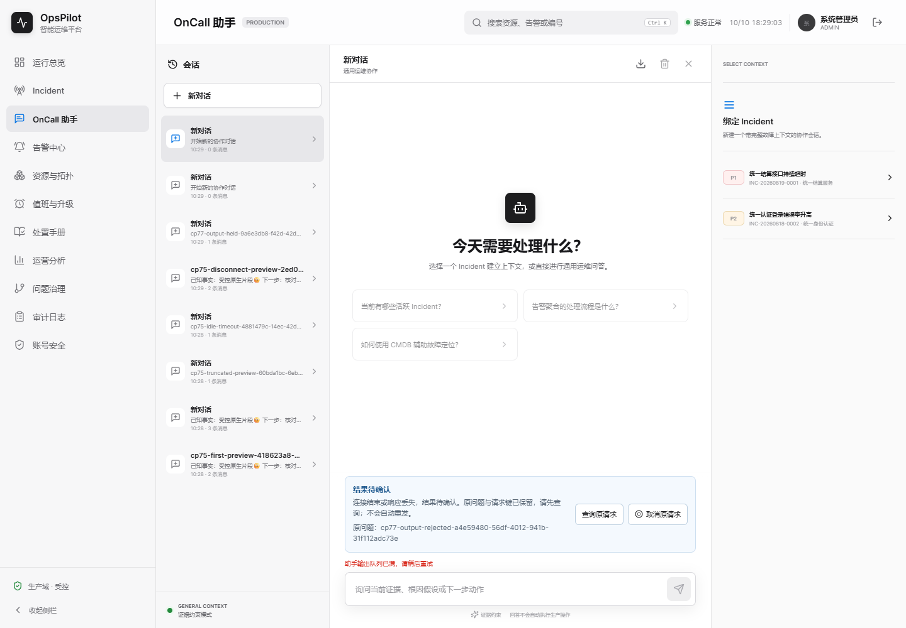
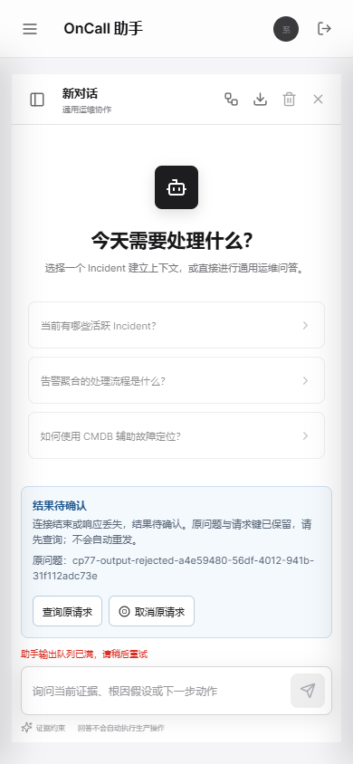

# OpsPilot V1.7 检查点106：真实升级闭环、Maven负缓存对照与原生读流观测（自身CI待验）

## 1. CP105自身终态与真实升级闭环

基线 `e32418003631a5852d6143c3dd2dfd61516c6916`，本轮保留前一轮未提交的CI/测试改动，无reset/restore。自己 [Run37778250400](https://github.com/Trigger726/OnCall-Agent/actions/runs/37778250400) 实际21作业：18success、认证打包与浏览器2failure、镜像1skipped。不能称整轮全绿，也不rerun覆盖首次失败。

[274检查/335文件七ZIP proof](../assets/v1.7-cp105/remote-first-proof.json)核验自己SHA、官方工件大小/摘要与实际字节，保存完整原始失败和限定成功。新增实际升级作业 `113314509325` 通过，工件 `11551212173`/36328字节/SHA256 `ffb81b966fa38c13c5e5eeb6b369ec4acccaaafeea2ccf0f547f96d0b1983f7f`；独立重放原门禁与CI保存结果相等。

真实MySQL8.4.11、schema `opspilot_open_upgrade_3a3c5ec44711`、serverUUID `41f1325d-c315-11f1-aaa0-321c063a2ae1`。旧源固定 `a1262f6765b46416a7fdc192642cf631465f4caf`，实际旧包SHA `a7600a9a00414c7c00e8666c616be538a9db4ad1cf895f427e19df7dabc94a0f`；新包 `2834dd148c5aba93fecf57037be0dd4c928b27ab8387702822bea484658e4538`。旧包经HTTP产生非空指定接班/互换/成对撤销历史，新包同库唯一升V38；原全行摘要/37版迁移校验和、取消后的实际责任和旧回执保持，认领丢响应/原键恢复/重启/并发/角色丢失等10流程全执行。1实际JUnit执行，失败/错误/跳过0；规范ID12为true，012/13/尾空格/1.2e1为false，在Maven/XML/审计JSON一致。五JAR完整连接池关闭、记录PID不存在、两端口释放、自有容器停止有直接证据。

其余限定成功：原生MySQL18/开放24门禁独立重放相等，默认HTTP8，双时区各714发现/518执行/196条件跳过/87XML与实际时区属性相符，前端175/build/full audit0。11完整JAR日志非预期ERROR0。其余13工件未逐一重放，远端截图未重新目视，CP104排序规则首失败及全部历史Demo继续保留。

## 2. 新的认证构建失败与最小处理

认证作业 `113314509004` 在 `./mvnw -B -DskipTests package` 阶段报告缺 `maven-jar-plugin:jar:3.3.0`，尚未执行业务HTTP，上传步骤因无业务文件未产生工件。完整GitHub作业日志保存在七ZIP proof旁，不能把缺工件当业务通过。

当时原因不能唯一确定：完整日志没有远端缓存文件或HTTP传输详情。本机访问官方Central该POM/JAR为200且下载JAR与本机既有字节SHA相同，但不能反推GitHub当时也可下载。为检查缺release缓存的机制，隔离自有新repository与9937回环镜像，运行真实Maven3.9.9三次：首次受控404→失败1并生成实际 `.lastUpdated`；随后镜像恢复可用，无-U仍失败1、目标请求0且日志明确cached miss；带-U后目标插件真实help执行/BUILD SUCCESS/退出0、下载字节与固定Apache JAR摘要一致。14断言/82回环请求，镜像关闭，不触碰生产repository或构建JAR。这只证明机制，不认定历史GitHub失败唯一根因。

依据 [Maven3.9.9 CLI文档](https://maven.apache.org/ref/3.9.9/maven-embedder/cli.html)，仅认证作业加 `-U -e` 检查缺失release/保留异常原因；原版本不变、只运行一次，不重试、不清缓存、不新增业务测试跳过（原打包命令的-DskipTests及后续所有独立runner保持）。完整stdout/stderr经tee保存在 `target/auth-build-it/maven.log`，always上传；pipefail不把构建失败变绿。实际Git Bash负对照：同一退出7的子命令，pipefail时管道退出7、无pipefail时退出0；原始日志与结果保存。

首次隔离实验的Windows包装命令引号错误（0请求）及过窄插件日志标签断言错误（实际插件已成功）分别保留FAIL，不伪称真实Maven失败机制。本轮Node最初作业截取边界误写backend而匹配到7次打包，也保留失败，修复到真实backend-h2边界；未改业务CI以迁就该夹具。

## 3. Linux原生第六项失败：仅补观测，不冒称修复

浏览器作业 `113314508939` 原14runner及助手9PASS。原生前5项完成，第六容量恢复读取报20秒TimeoutError：两个持有流都HTTP200、取消事件前缀存在，运行流EOF/343字节，排队流仅21字节/无EOF；排队及被拒绝问题的模型调用0。两者只证明收到部分数据，不等价于完整取消帧/结束或成功恢复。后续通知、成对和开放页面未执行。原工件 `11550962403`/8750816字节/官方SHA匹配，原JSON、failure截图、完整日志均保存。

生产代码/DDL/页面不改。本机Windows/Chrome154/Playwright1.63/Node24运行原脚本六项PASS，不能解释Linux/Node22的首失败。仅增加容量子阶段、实际响应Content-Type、受控响应正文、限量读取时间/字节及EOF/读取失败的观测字段；保留20000ms原AbortSignal、12秒执行预算、两取消POST、两EOF/无done/无排队模型、真实503/0问题/0模型、404/原键/原问题手动恢复等所有原断言。没有提高时限、提前结束读取、屏蔽失败或重试整个runner。新源码自己的Linux仍待验证；若失败再现，按新阶段/字节证据继续定位。

## 4. 本机页面复核与新旧对照

使用karpathy-guidelines将更改限定于实际失败入口；frontend-testing-debugging要求实际页面复核。当前未列出Browser skill，记录 `Browser plugin not available` 并用项目现有Playwright/已安装Chrome，不安装新依赖。流程：`/assistant`→真实片段→完成/取消/超时→双持有流造成真实503→释放自有夹具→查询404→手动同键/同问题完成。

本机原版 `run-wCW0u0` 与仅观测增强后 `run-y05CCw` 六项case事实完全相等且PASS。新观测两个持有流Content-Type均SSE，取消完整JSON/EOF分别343/108字节，554/437ms结束；这不是故障Linux的测量。原有CP103旧等待→新即时片段的Demo完整保留；本轮新增截图只是当前回归状态，不制造UI重设计或“Linux已修复”的前后图。

| QA检查 | 本机结果与边界 |
| --- | --- |
| 页面身份/非空 | `/assistant`、标题OpsPilot智能运维平台与有效正文，PASS |
| 框架overlay | 截图前检查0，PASS |
| 控制台 | pageerror0；实际503/404对应各1资源日志，其他错误0 |
| 桌面/手机 | 1440×1000与390×844，横向溢出0；已目视本轮拒绝两图 |
| 交互 | 全六项，原键手动恢复1模型/1答案，PASS |
| 远端 | CP105原生第六项FAIL仍保留，CP106自己Linux待验 |

命令：`node --test scripts/tests/*.test.cjs` 全161通过/零跳过；真实SnakeYAML禁止重复键配置并解析21作业；`node scripts/verify-assistant-native-ui-ci.cjs` 在改前/改后分别完整运行。未在本轮重新执行本地整套Java或其他页面，CP105自身双时区/真实MySQL成功范围由独立工件证明，不借用为新CI结果。

[58检查/45文件本地proof](../assets/v1.7-cp106/local-proof.json)保存修改源摘要、完整Node、YAML与实际Maven版本、隔离实验及首失败、Bash负对照、两次六流程/完整JAR日志/各9图。JAR仍为 `23166b42d25de242fd7d02183ed8e45554d4c599f5e404d951b0f5eb9b91122e`。自有两个记录PID已不存在，9937/9955/9956无监听；Windows日志没有池关闭的，不冒称优雅停机。

本次提交自己的完整CI待验；开放通知/提醒/真实渠道、计划成员ACL、认领撤销、DST/日历和跨机器生产容量等完整路线继续，目标active。

### 本轮截图

## 5. 自身 Linux CI 闭合与下一业务阶段（2026-10-10追加）

本检查点实际提交 `d0cb78f708b977b6ef79935ad7356eb4f569a517` 的 [Run38045645946](https://github.com/Trigger726/OnCall-Agent/actions/runs/38045645946) 原始 attempt1 已终态 completed/success，21 个作业均 success，包含 Collector 与最终镜像烟测。不是重跑 CP105，也不覆盖 CP105 两个首次失败。以上历史“待验”对应提交前时点，现在以本节为准。

[191检查/83文件远端 proof](../assets/v1.7-cp106/remote-close-proof.json)仅下载并逐字节验证两个官方 ZIP：认证 `11667344033`，116860 字节/SHA256 `cdaf6a13e9492dbfa61a576df2726a3da0b81b0078b7f56d8052f0c06bd961f6`；浏览器 `11666713731`，14793671 字节/SHA256 `6d31944f81bd04a31bf5bc06da98b747caaa605204cc50bac19164d3a6f439a9`。官方工件 run/source、大小、实际摘要一致。保存全部选定 ZIP 的 JSON/log、14 原脚本日志、25 完整生产 JAR 日志、两个解码作业日志与终态 run/jobs/artifacts 元数据；没有重新目视远端图片，其余十九 ZIP 未下载或独立重放。解码 API 日志保存为 UTF-8/LF，不把它们冒称带官方 ZIP 摘要的原始字节。

认证实际执行一次 `-B -U -e -DskipTests package`、pipefail/tee，原 `jar:3.3.0:jar` 正常执行、BUILD SUCCESS。打包的既有 skipTests 保持，后续八个独立业务 runner 全执行，原身份撤销/密码变更/重启、Agent SSE、助手6、原键3、取消3、跨节点6、慢消费者5、互换HTTP2均有原始运行事实和自有进程清理记录。认证实际 JAR `f7b8730090fdc8b2583e0886d449ab4f75ebf7f3f15d1fa678b8992d2f72fefc`；浏览器独立构建 JAR `b6ec8b8c606e0089216b627b6549b1d41ac79677da18813c513c0ca51cad6c43`，不同作业不假定包字节相等。

Linux 原生 `run-Be7NiU` 全六项 PASS，前五项 case 事实与 CP105 原失败逐项相等。第六阶段 complete：两持有流实际200/SSE、完整取消 JSON，无done，自然EOF 343/108字节、729/617ms，未提高原20秒预算；排队模型0，拒绝时0问题/0模型/原键404，手动同键同问题恢复只调用一次模型/落一条答案。pageerror0、意外控制台错误0，仅实际503/404资源日志各1。后续通知12、成对HTTP3/页面14、开放页面33全执行；原14脚本全部exit0、助手9也通过。不能以一次成功唯一解释 CP105 的21字节读流超时或缺插件根因。

本轮 karpathy-guidelines 要求先用权威终态/原始正文核对结论，再限定下一变更。生产 Java/DDL/UI 未改，不生成虚假的新视觉功能 Demo；所有历史旧包/失败/截图继续保留。

下一阶段[计划成员权限契约](../ONCALL_PLAN_MEMBERSHIP_DESIGN.md)已经明确响应/管理分离、一次性 V38 兼容回填、新账号/计划不自动授权、撤销不抹责任、原回执只读恢复、全分配入口与续排及真实有数据升级14门禁。它仍是设计，不是已实现的成员 ACL，也不是开放通知/提醒/真实渠道已交付；完整目标 active。
