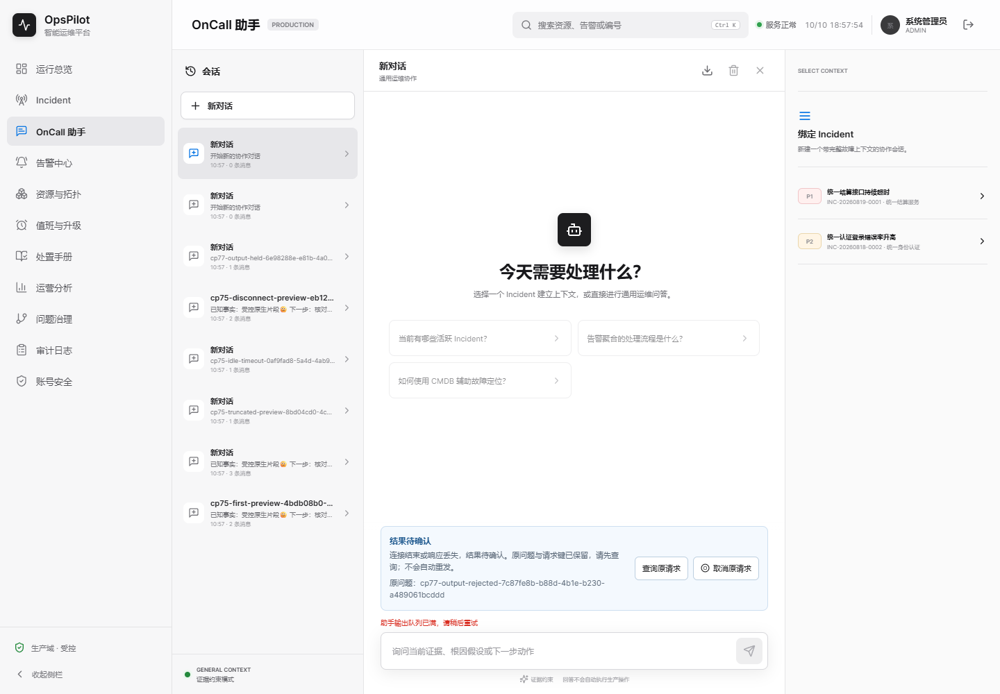
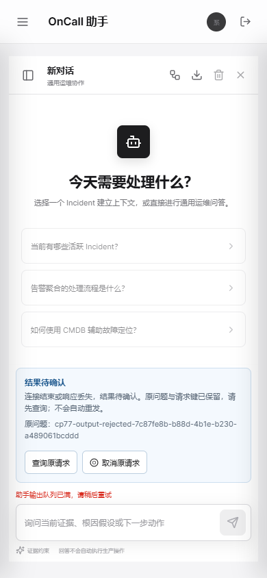

# OpsPilot V1.7 检查点107：完整取消帧门禁与计划成员契约

## 本轮结论

CP106自己 `d0cb78f708b977b6ef79935ad7356eb4f569a517` 的原始 [Run38045645946](https://github.com/Trigger726/OnCall-Agent/actions/runs/38045645946) 已21作业success。认证实际-U/-e/pipefail一次打包与八独立runner、Linux原生六/两EOF以及后续通知12/成对HTTP3/页面14/开放33由[191检查/83文件的两ZIP proof](../assets/v1.7-cp106/remote-close-proof.json)限定核验，详见[106追加](V1.7-checkpoint-106.md#5-自身-linux-ci-闭合与下一业务阶段2026-10-10追加)。其余十九工件未下载重放，旧CP105失败保留，成功不是唯一根因证明。

本轮新增实际可执行的取消完整帧门禁与六个自动化测试；Node全167通过，本机原生真实页面完整六流程通过，改前/后case事实和生产JAR字节相同。新源码自己的Linux CI仍待；不借CP106绿灯冒称本轮新门禁远端已执行。没有生产Java、DDL、UI改动，未重跑整套Java或前端构建。

## 测试改动与负对照

`scripts/verify-assistant-native-ui-ci.cjs` 原来在两持有流都EOF后检查 `event:cancelled` 前缀/无done。本轮保留全部旧断言，再要求HTTP200、实际SSE Content-Type、有界正文、唯一且最终的完整取消帧以及精确JSON `{type:cancelled,content:回答已取消,messageId:null,evidenceJson:null}`。两个请求均等待自然EOF，没有提前退出读取；原20秒AbortSignal和12秒执行预算、六个case-ID、两取消POST、模型/问题0与原键恢复均保持。

`assistant-native-ui-cancellation.test.cjs` 六个测试覆盖：完整取消/带真实片段取消；只有21字节前缀、缺终止空行、假JSON/错type/错误ID；重复取消/取消后还token/done/垃圾；错误状态/Content-Type/坏JSON/超长正文；不改原CP106 Linux工件而验证其两完整正文；原六case/预算/自然读流仍在真实runner。夹具负对照不是新生产故障证据，也不认定 CP105 首次Linux超时已由这12行检查修复。

CI 保留原浏览器作业和步骤，先执行新增六个门禁测试，再运行原生真实六流程；没有以合成测试替代实际页面，也没有增加失败容忍或重试。

实际 SnakeYAML2.2 解析修改后的 YAML 为21作业，LoaderOptions配置拒绝重复键；本轮没有执行故意重复键的YAML夹具，不将配置声明冒称该负对照已运行。

命令 `node --test scripts/tests/*.test.cjs`：167测试、167pass、fail0、skip0，其中新增6；完整日志在[本地proof](../assets/v1.7-cp107/local-proof.json)中。直接 `node scripts/verify-assistant-native-ui-ci.cjs` 本机 `run-bn00gm` PASS6，原来CP106本机 `run-y05CCw` 的全部业务case事实逐项相等。生产JAR仍 `23166b42d25de242fd7d02183ed8e45554d4c599f5e404d951b0f5eb9b91122e`，不能把其他CI作业独立构建的不同包摘要混用。

## 渲染QA与边界

采用karpathy-guidelines限制为实际验收缺口；frontend-testing-debugging要求实际交互与截图核对。Browser plugin/browser skill当前未列出，记录 `Browser plugin not available`，用已有Playwright1.63/Chrome154、Java21/Node24，未安装依赖。目标流程：`/assistant` → 完成前片段 → 完成/显式取消/截断/超时/断开手动核对 → 双持有输出造成真实503 → 两取消流完整EOF → 原键/原问题手动恢复。

| 检查 | 本机结果 |
| --- | --- |
| 页面身份 | `/assistant` 与标题OpsPilot智能运维平台匹配 |
| 非空/overlay | 有有效正文，无框架overlay |
| 控制台 | pageerror0、意外console0；实际503/404资源日志各1 |
| 截图/响应式 | 1440×1000与390×844无横向溢出；已目视两张容量拒绝图，原键/错误/查询按钮清楚 |
| 交互 | 原六全执行；新强断言验证两取消JSON/自然EOF343/108字节，567/534ms；手动原键恢复一模型一答案 |
| 清理 | 自有PID28112不存在，9955/9956无监听，自有Provider已停止 |

九张当前状态截图与完整JAR/Node日志、源文件摘要/清理证据均保留在[本地proof](../assets/v1.7-cp107/local-proof.json)。它们是同UI的回归对照，不是新视觉功能；CP103旧等待→新片段以及所有历史Demo/失败不覆盖。未测新门禁的Linux/其他浏览器或生产规模，未对远端图片重新做视觉验收。

## 下一业务阶段：计划成员权限

[成员契约与14门禁](../ONCALL_PLAN_MEMBERSHIP_DESIGN.md)已依据当前真实调用链明确：响应/管理分离，兼容V38一次性回填后新账号/新计划不自动加入；撤销不自动取消既有责任，原键原内容回执仍只读核对。需要覆盖roster、轮转续排、指定接班、双向互换及开放认领，不允许只在页面过滤或只修一个入口。

迁移/API/成员页面、共享H2/MySQL新测试、实际非空V38→V39 JAR升级与新旧Demo均尚未实现。现严格V38门禁不能仅放松版本断言来获得绿灯。先完成这些真实成员权限，再接开放请求合格接收人/广播/提醒；真实渠道、认领撤销、DST/日历和跨机器生产容量仍在完整路线内，整体目标active。

### 截图

