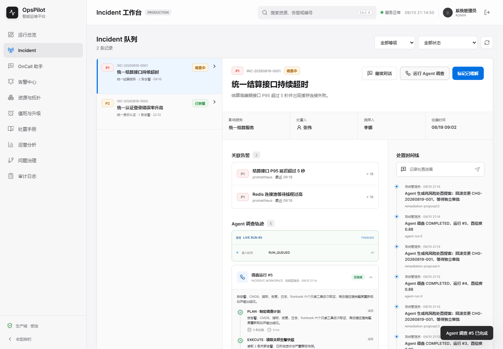
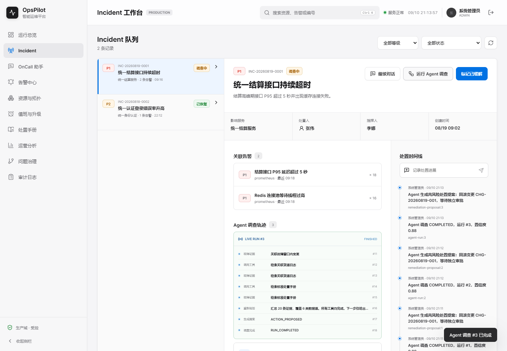
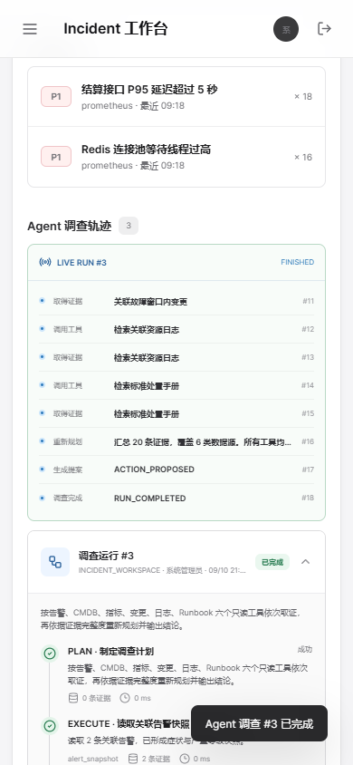

# V1.7 checkpoint-14：前端自动续订与新旧 Demo 对照

日期：2026-09-10 完成实现与浏览器测试，2026-09-12 复核归档。状态：本地通过，远端 CI 待验。

## 行为变化

Incident 与 OnCall 共用流服务在 POST 提前结束、幂等复用关闭或网络错误后自动恢复：已取得 runId 时，只请求 GET `/agent-runs/{runId}/events/stream?after={cursor}`；尚未取得 runId 时，使用同一个幂等键重试 POST，不主动生成第二个调查键。runId 可来自响应头或第一条有效事件。

游标仅在页面回调成功后推进。同一 run 的重复/较旧 ID 不重复渲染；非安全整数、非正数或归属不一致的 ID 拒绝。UTF-8 跨字节、CRLF 和多行 data 可解析；未完成的尾帧丢弃并从已接受游标回放，不把截断 JSON 当作已处理事件。

五类终态立即停止读取和重连，并轮换后续调查的幂等键；队列饱和仍返回可解释错误。401 触发登录失效且不重试；其他不可重试 4xx/协议错误/回调错误停止。网络和 5xx/429 允许退避重试，连续无进展最多 6 次尝试（5 次重试），等待上限 8 秒；取得新事件后重置无进展计数。耗尽后提示后台调查未被取消，保留键供后续恢复。

AbortSignal 同时控制请求与退避等待，finally 取消 reader 并释放锁。切换事故、切换/创建会话或组件退出只中止订阅，不调用取消调查接口；清空旧实时轨迹，并阻止被中止调用在 finally 回刷旧详情。

**恢复范围**：runId/cursor 保存在当前异步调用内存中；不是跨刷新持久化游标。sessionStorage 保存的是幂等键。浏览器刷新后的自动挂接、跨账号存储命名空间、恢复次数/连接状态 UI 仍未完成。

## 自动化验证

新增 `web/tests/agentStream.test.mjs`，使用 Node 内置测试器与现有 Vite 依赖 esbuild 编译实际服务代码，不复制生产逻辑，不新增依赖。

9 项测试全部通过：截断 POST 转 GET/去重、空复用响应头恢复、未知 POST 结果同键重试、中文与分块/多行解析、五类终态与队列饱和、401 不重试、无进展上限、等待中 Abort、外来事件/页面处理错误。`npm run build` 通过；GitHub Actions 前端门禁新增 `npm test`。

测试中的计时器加速仅验证次数和停止逻辑，不等于真实退避时长测量。后端未修改，本轮远端仍执行完整 H2/JAR、MySQL、Redis 与容器门禁。

## 真实页面 QA 与旧版对照

环境：`http://localhost:5173/incidents` → Vite 代理 `localhost:9900`，独立 H2 内存演示库、AI 关闭。Playwright 1.62.1 + headless Edge，1440×1000 / 390×844。Browser plugin not available，按前端测试技能使用现有 Playwright，不安装依赖。

流程：登录 admin → 事故工作台 → 运行 Agent 调查 → 拦截 POST 响应只向浏览器提供 RUN_QUEUED → 观察 GET 补读与 FINISHED。拦截器先取得真实后台完整结果后缩短响应，因此证明的是已持久化事件的早 EOF 恢复，不是运行中断网、TCP reset 或双实例故障。

| 证据项 | 旧版流服务（283bc19） | 新版 |
| --- | --- | --- |
| POST 次数 | 1 | 1 |
| GET 自动续订 | 0 | 1，run #3、after=37 |
| 数据库事件总数 | 18（run #5） | 18（run #3） |
| 实时面板 | 仅首条 RUN_QUEUED | 补齐至 RUN_COMPLETED，面板按原设计显示最后 8 条 |
| 详情刷新 | 可显示已完成调查，但不能补齐实时面板 | 完成后正常刷新详情 |

旧版使用 `git show 283bc19:web/src/services/agentStream.ts` 只读提取，在测试页面注入编译后的旧服务；其他页面代码保持当前版本。没有 reset/checkout，也没有将此对照冒充整个旧版部署。既有原版备份与历史 Demo 不改动。

| QA 检查 | 结果 |
| --- | --- |
| URL/标题、非空内容 | 通过：Incident 工作台，OpsPilot 智能运维平台 |
| 框架错误覆盖层、控制台 | 无相关错误或覆盖层 |
| 截断恢复交互 | 一次 POST + 一次 GET，事件集与数据库一致，终态停止 |
| 390px 布局 | 动画结束后无横向溢出，轨迹终态可见 |
| 切换事故 | 暂停 GET 后切换至事故 2，中止旧请求；无旧面板、无跳回、无额外 GET |

测试脚本初次把登录目标误写为 `/incidents`（实际为 `/`），修正后执行；首次移动截图截在视口变化的侧栏动画中，等待 500ms 后复验无溢出。没有为测试结果修改产品样式。

截图保存在本目录 assets/V1.7-checkpoint-14，后续不可覆盖为新版本 Demo。生产构建更新了静态 JS 文件名；旧包仍由 Git 历史保留。

## 剩余风险

OnCall 使用同一服务并补了会话切换保护，但本轮未完成 OnCall 页独立浏览器交互。未验证真实双 Web 实例共享 MySQL/Redis、运行中断网、Redis 重启/裁剪、真实慢客户端资源释放。仅本检查点闭环，不声明整个 V1.7 完成。

## 截图

旧版 POST-only 对照：

新版桌面恢复：

新版移动端恢复：

