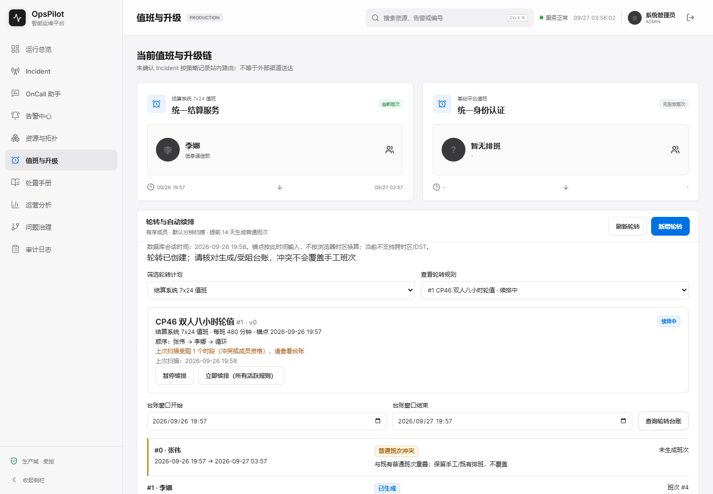
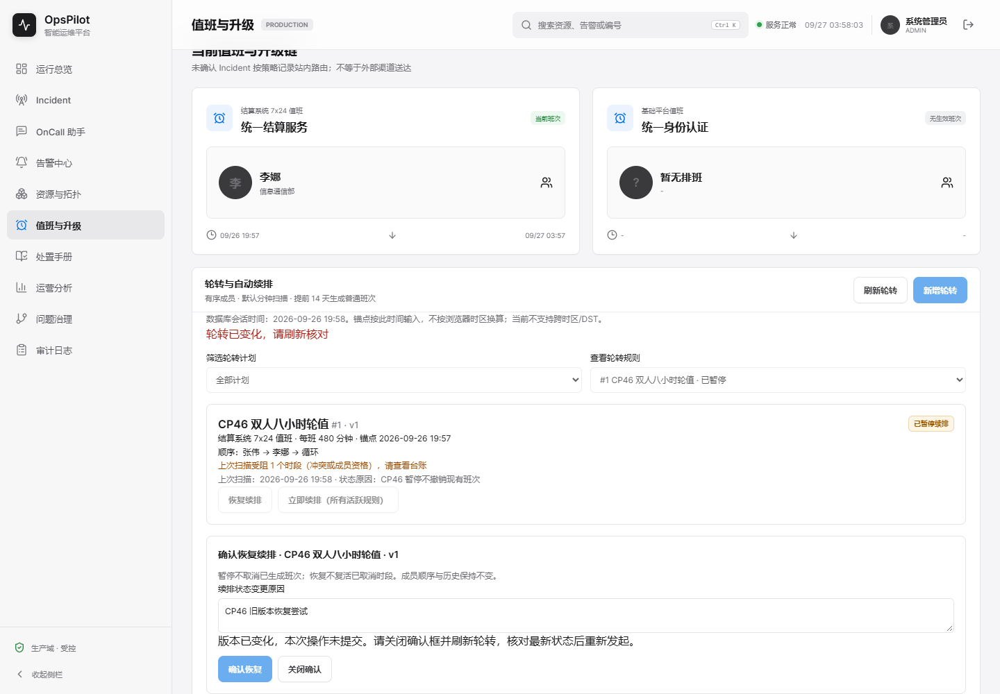
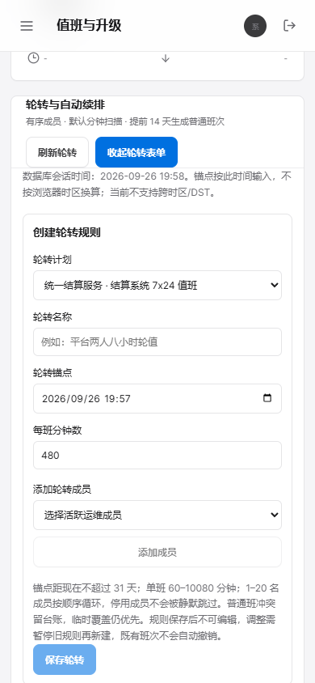
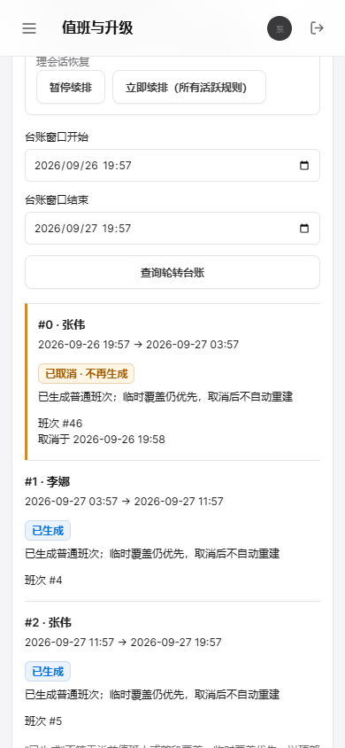

# V1.7 checkpoint-46：轮转管理与台账页面

日期：2026-09-27。状态：本地通过，前端 21 项、双时区后端、最新 JAR 和桌面/390px 实际交互已验；远端 CI 待补证。本检查点只关闭轮转页面这一缺口，不等于全球排班/项目总目标完成。

## 改动范围

保留 checkpoint 43 的普通/临时覆盖班次维护与历史 Demo，在值班页新增轮转面板，对接 checkpoint 45 的 V26 API。创建显示成员顺序、锚点和班长，可上移/下移/移除成员；暂停/恢复要求原因与捕获的版本，冲突后禁止重复提交并要求核对最新状态。台账显示生成/冲突/成员不可用与取消来源，不将生成事实冒充当前覆盖；普通班次与轮转面板互相刷新。

按固定数据库会话时间输入和显示，不做浏览器 UTC 换算，不声称多时区/DST。参考 [Grafana 排班校验与保留历史](https://grafana.com/docs/grafana-cloud/observe-and-act/respond-to-incidents/on-call-schedules/create-schedules/) 的业务思路，但本轮没有实现其日历、换班和多层能力。

## 当前验证

新增 8 项 Node 自动化验证：时钟口径、取消/资格状态区分、扫描警告、角色限制、输入边界、创建顺序/DTO、状态版本冲突不重试，以及截断/部分失败反馈。与原 13 项共 21/21 通过，`vue-tsc -b && vite build` 通过。

Browser 插件技能未安装（Browser plugin not available），采用已安装的 Playwright/Chrome，不新增浏览器依赖。URL 为 `http://127.0.0.1:9917/on-call`，桌面 1440×1000、手机 390×844；浏览器上海时区、JAR UTC，使用独立 H2 内存库。默认 60000ms 扫描在验收中缩短为 200ms，不修改数据库时钟或日常文件库。

UTC `package` 与上海时区 `test` 各发现 169 项、执行 135 项、Docker 条件跳过 34 项、0 失败/错误；最后一次前端构建之后再次打包最新静态资源。后端生产代码和迁移未改动。见 [local-result.json](assets/V1.7-checkpoint-46/local-result.json)。

## 实际交互结果

1. 在原单班维护创建李娜的首个普通班；轮转表单添加李娜/张伟，通过下移改为张伟→李娜并保存，API 成员顺序 `[2,3]`、锚点原文不变。首时段 `BLOCKED`，第二时段 `GENERATED`，页面提示受阻 1 个，不覆盖手工班。
2. 同计划重复创建返回实际 409，规则仍只有一条。暂停填写原因后刷新保持 v1/暂停，既有生成班不撤销。
3. 页面捕获暂停 v1 后，另一 HTTP 管理会话恢复到 v2；页面旧版本提交实际返回 409，确认按钮禁用、提示关闭并刷新，不隐式重试。核对 v2 后才能重新操作。
4. 从单班维护取消手工占用，等待真实后台补齐（此前不调用 scan），刷新轮转后顶部变为张伟，新 P1 Incident 3 的实际首步为 `zhangwei/ROUTED`。取消生成首班后立即续排新增 0 班，原班次 ID/取消时间保留，刷新仍显示“已取消 · 不再生成”，顶部无当前负责人。
5. 手机打开表单和台账，文档宽度严格 390px，无横向溢出；审计员可读/刷新、看取消事实，四个管理按钮均不存在。2026-08 两条历史班次 JSON 前后逐字段相同。
6. 第二计划真实创建一小时规则，初次台账显示 200 条及截断提示；缩小到首个一小时时段只剩一条，非法零长度窗口实际 400 且旧台账清空；计划切换后摘要与台账对应所选规则。

真实结果见 [browser-result.json](assets/V1.7-checkpoint-46/browser-result.json) 与 [boundary-result.json](assets/V1.7-checkpoint-46/boundary-result.json)。列表 100 条截断、成员资格撤销与部分扫描失败另用明确标注的响应夹具检查**页面呈现**，并非本轮真实修改账号或注入后台故障；其真实后端一致性证据仍是 checkpoint 45 的共享 H2/MySQL 场景。

| QA 检查 | 结果 |
| --- | --- |
| URL/标题、非空页面、无框架报错浮层 | 通过 |
| 控制台健康 | 无 pageerror；两个 409 分别对应重复创建和真实旧版本，未发现其他相关错误 |
| 交互与持久化 | 创建/暂停/竞争/补齐/取消/刷新/只读通过 |
| 桌面/手机截图 | 已实际检查，390px 无横向溢出 |
| 最终 JAR 日志 | 未处理错误匹配为 0；验收进程已停止，9917/9921 无监听 |

首轮发现成员选择框可访问名称不稳定，已补明确 `aria-label`。补充脚本曾因已有按钮不能证明选中规则变化、退出时 route 回调尚在途而失败；改为等待实际摘要/行数、`aria-busy=false` 并排空回调后，以退出码 0 重跑。失败运行不作为通过证据。

## 可复跑命令

先构建并启动**自己拥有的干净隔离内存 Demo**（9917/9921，AI 关闭，UTC，轮转 200ms 验收参数），不要连接日常 9900/文件库。已有 Playwright 可由模块路径提供，不在仓库新增依赖：

```powershell
$env:OPSPILOT_ACCEPTANCE_ISOLATED='1'
$env:OPSPILOT_BASE_URL='http://127.0.0.1:9917'
$env:OPSPILOT_PLAYWRIGHT_MODULE='<已有 Playwright 模块绝对路径>'
$env:OPSPILOT_CHROME_PATH='<已有 Chrome 可执行文件路径>'
node scripts/verify-oncall-rotation-ui.cjs
node scripts/verify-oncall-rotation-boundaries.cjs
```

两份已提交脚本在本地再次执行均退出 0；截图/JSON 写入独立系统临时目录。必须先跑主流程再跑边界流程，测试会创建/取消隔离库记录，不能用于用户业务数据。当前 GitHub CI 执行 Node 21 项与生产构建，**尚未把真实浏览器脚本接入 CI**。

## 新旧 Demo 对照

| 场景 | checkpoint 43/45 保留 | checkpoint 46 |
| --- | --- | --- |
| 规则管理 | 单班表单 / 轮转仅 API | 有序成员表单、暂停/恢复原因与版本 |
| 排班异常 | 普通冲突 409 / 后端时段台账 | 页面解释受阻、取消来源与资格，不静默换人 |
| 新事故 | 手工排班后路由 | 真实后台补班后路由，取消后有意留空 |
| 视觉证据 | 原桌面/390px 截图不改 | 新面板桌面/手机交互截图独立归档 |

原始 OnCall 仍在本地 `archive/oncall-original-2026-08-19`，旧代码可从 Git 历史独立查看，未 reset/恢复旧文件。构建仅替换当前 hash 静态资产，旧包在 Git 历史可恢复。

旧桌面：[checkpoint 43](assets/V1.7-checkpoint-43/desktop.png)。本轮证据：






## 剩余边界

跨时区/DST、换班/日历、外部通知/人工回执仍未交付；没有验证 Safari/Firefox 或实际手机系统。即时刷新是显式操作，不宣称轮转/顶部负责人已支持无刷新推送。生成事实不等同覆盖率；没有完整的日历覆盖预览。整体持续迭代目标保持进行中。
