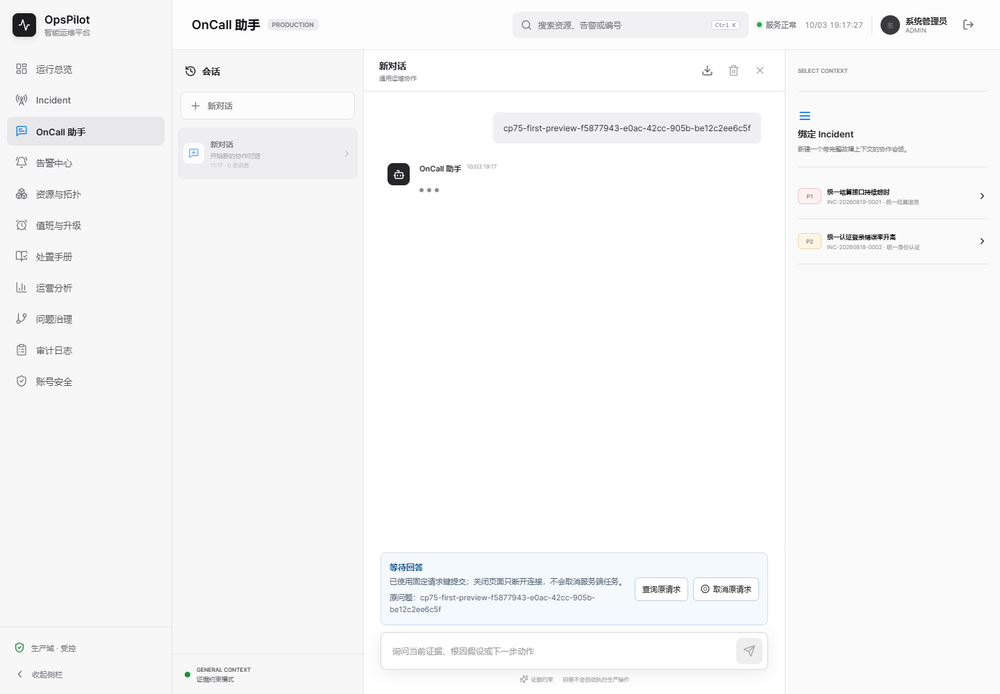
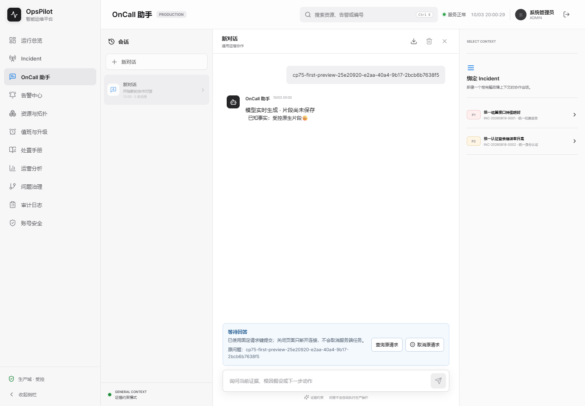
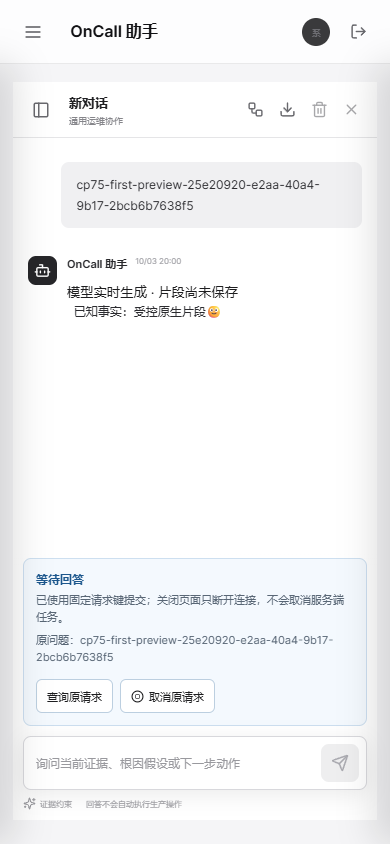
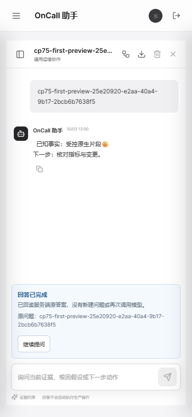

# V1.7 checkpoint 75：默认助手原生片段与一致性

当前状态：默认端点/页面原生流本地限定通过，自身远端CI/真实MySQL待验；整体目标active。

## 阶段一：范围与旧版

上一轮确实推进并上传了底层原生适配器及17项测试，不是完整端点交付。本轮从当前干净f792e17d8bfd9114ed9548b1431df86f92989bb7继续，先核对其Run37117383000；当前多个作业仍真实in_progress，不能借73全绿说明74自己的远端通过，不因观察超时重启CI。

旧74包保留于target/cp75-before/opspilot-cp74.jar，SHA256为6141613a3bb0b447cb0d39438b135c560a6c11be7b2ddeb192a7b9c6479a80c1。原始OnCall归档、旧页面Demo/失败均保持，不reset。使用最小改动及前端验证技能，目标是原生模型片段实际在模型结束前经过默认/session/stream到达页面，而不是只验证新的未接入方法。

协议明确区分generation/token临时片段（messageId=null，无已提交证据）与事务提交后done真实答案ID，已完成键仍回放原答案，不重新调模型。服务端有界worker内消费有背压的原生订阅，空闲时也检查原租约/原预算/持久化取消，取消订阅而不线程中断冷JAR加载；保留同一最终SQL事务、请求终态/答案/审计原子性。AI关闭仍是规则证据模式，不冒充原生模型；AI已开启的原生流截断或失败不混入规则降级。

沿用73已经明确的用户意图：浏览器断线仅是不确定结果，后台在原授权/预算内继续，刷新需手动查询，不自动重发或自动取消。显式取消才是原键持久化取消；原生流订阅必须被取消/预算/撤销实际释放。计划用真实受控HTTP端点/SQL事实、原界面八流程及桌面/390px新旧对照验证；未执行前不写通过。

## 阶段二：端点反例与初次接入

旧默认端点真实HTTP反例已执行：target/cp75-before/native-endpoint-counterexample.log为1执行/1失败/0错误/0跳过，实际没有X-DashScope-SSE，证实不是端点原生流。原前端新增协议用例同样失败，两份失败日志及旧74 JAR保留。

接入后的初次真实HTTP验证通过，扩展矩阵target/cp75-before/native-endpoint-matrix.log为12执行/0失败错误跳过：5项端点集成与7项有界消费测试。真实模型结束前generation/token到达且SQL答案为0；正常结束原样提交并发布done，重复键回放不再调用模型；显式取消后旧Provider仍被独立门闩持有时同一单worker能完成新真实HTTP流；空闲8秒预算超时不提交片段；无stop的EOF持久化FAILED且不混入规则降级；浏览器真实关闭输入流后原请求完成，GET核对原答案无需另一次POST。

前端助手请求测试target/cp75-before/native-client-after.log为23通过/0失败跳过，包括原19项及4项新增原生协议测试（其中9个恶意协议子场景）；原键不旋转、不自动重发，临时片段不发布正ID，UTF-8逐字节/取消/EOF/error成立。新增页面临时标记和默认回归、双时区全量、真实桌面/手机对照尚待执行，不能凭这些单测宣称页面交付。上一版本Run37117383000已现场观察15作业completed/success；工件源SHA/摘要及独立重放还未执行，不将上一版本结果借给当前接入。

## 阶段三：更晚围栏与真实页面首轮

进一步的撤销登录、清空对话、临时片段后审计CHECK失败已通过，native-endpoint-fences.log为8项真实HTTP端点+7项消费测试，15执行/0失败错误跳过。CHECK失败确实回滚答案/标题/完成审计，原问题保留、键FAILED，拒绝重跑；done不越过失败事务。原助手回归83项通过；前端全量107、生命周期17及构建通过。UTC全量package为491发现/385执行/106条件跳过、0失败错误；保留三处已有故障注入ERROR，不宣称日志零ERROR。

旧74 JAR真实页面对照run-lUGRk2为BASELINE_CAPTURED：桌面/390px看不到提前片段，结束后才显示答案，JAR仍为原6141613a摘要、应用日志无意外ERROR。新JAR为4c3a0ee1626e6f9e558e865defa1a1e2523a3f18d2d98919f161810247ae88d4；首轮run-S5NWef为FAIL，原生预览桌面/手机、提交及取消手机图已生成，但取消后的新问题验收未完成。实际原因是受控Provider按整个提示词contains寻找问题，历史正文包含旧问题导致匹配旧控制器；改为只匹配当前user提示词末尾问题，不改生产逻辑、不放宽worker复用断言，失败日志/四图保留，等待复跑。

74自身的原生工件11271878139已下载并独立核对源SHA、官方digest与ZIP实际SHA一致（3a5fb2f3bbf02fd0bfc0c5af54acea49aa68fbc506aa3082fe4bc503d3d27fc1），两XML13+4=17零失败错误跳过，完整Maven日志两处明确controlled transport failure为既有SDK故障注入；见[74原生远端证据](../assets/v1.7-cp74/new/remote-native.json)。74其他工件尚未独立重放，当前75自身远端未执行。

## 阶段四：不能把worker释放等同于HTTP释放

修正Provider匹配后的run-izb5rC五个实页流程通过：真实提前片段、取消且原单worker复用、EOF失败、12秒空闲预算、刷新后仅GET恢复原答案；原八个实页流程run-PnEwJV也通过，真实503/丢响应/晚200身份围栏保留。新旧桌面及390px预览已目视，无横向溢出或遮挡，临时答案无复制按钮、无正ID；默认构建107测试通过。上海全量同样491发现/385执行/106条件跳过，0失败错误，三处故障注入ERROR与UTC相同。

随后刻意补了更强的物理连接断言，而不是到PASS就结束。run-RzkHiC真实FAIL：取消后新请求已完成，但原受控Provider仍gated、transportClosed缺失，实际连接未关闭；不能把前述worker可复用外推成上游释放。保留四图/结果/完整JAR日志，以及对应中间包target/cp75-before/opspilot-cp75-first.jar（4c3a0ee1626e6f9e558e865defa1a1e2523a3f18d2d98919f161810247ae88d4），不删除断言或靠测试端release掩盖。

锁定依赖字节码已检查：DashScopeApi的chatCompletionStream在实际HTTP body之上有windowUntil/内层reduce链，不能由只mock ChatModel的cancel回调证明实际socket断开。新增仅对助手原生调用Reactor Context生效的传输取消信号，在WebClient交换及原始响应body前置takeUntilOther；任何原生终止都关闭这一原请求的HTTP订阅，其他Agent/同步/不带标记的HTTP路径保持不变，不改模型参数/凭证/底层SDK版本、不增加线程或定时器。Reactor窗口的生命周期说明见[官方API](https://projectreactor.io/docs/core/3.7.17/api/reactor/core/publisher/Flux.html#windowUntil-java.util.function.Predicate-)；SDK窗口链是定位依据，仍以相同真实连接断言复跑作为修复证据。

传输测试首轮testCompile因Java var复合声明失败，未执行任何测试，native-transport-first.log保留；已拆为两个声明。新6项传输边界测试、最终包双时区/所有真实runner复跑尚待完成。本阶段3个真实HTTP助手session/幂等/取消runner在中间4c3a0ee包上通过，不能借它们证明新增传输修复。

第二次native-transport-fixed.log同样是testCompile失败：测试缓冲区推断为DefaultDataBuffer，不能用于严格Flux<DataBuffer>接口；显式声明DataBuffer后再跑，不将这两次编译失败计入测试执行数。

## 阶段五：连接释放之后仍有两个实际反例

11433e67d4a3a5765587d51d4779ab2e5d94368c18ef9244cc036018c82f4ec8包的run-hWAnjo五个原生实页流程通过，取消/超时均在Provider门闩释放前观察到实际HTTP关闭。UTC全量497发现/391执行/106条件跳过、零失败错误。但上海全量有1个真实失败：EOF后的FAILED未发送error，仅收到generation/token；原八UI run-BU6sXr和session run-1pF18p也真实FAIL，业务断言通过不代表完整日志门禁通过，分别出现3/1个Reactor onErrorDropped。

锁定Reactor3.6.0字节码显示，MonoCompletionStage取消后仅忽略直接CancellationException，JDK取消包装为CompletionException(CancellationException)被当成未消费错误。未删除日志门禁、未设全局Hooks、未忽略真正Provider失败。改为助手原生Context专属的单个JDK连接器：订阅方Future先直接取消，再传播到真实JDK交换；正常成功/异常原样传播，原同步/Agent等保留Boot连接器。该原生专属客户端使用JDK默认TLS/代理配置；未来自定义原生客户端TLS/连接器须另行配置及验证，不能外推已支持。

EOF丢事件的原因是管理器已经设置停止原因、另一个线程的停止回调仍在持久化/授权时，worker的catch先关闭SSE，抢走error事件。worker在已停止分支不再提前关闭，让原停止回调发布授权后的唯一终态；新增EOF十次重复验证。不把未执行的修复写成通过；中间包、失败日志及截图均保留。

修复后54项原生契约/真实HTTP测试通过，双时区各513发现/407执行/106条件跳过、零失败错误；最终包735d0f2d45e90cefab372dcfb13aa7c8e5b5624a82ca9b091393163171c27151。原生实页run-uT5BMU五场景、原八UI run-Z7HwtH均PASS，完整JAR意外ERROR=0。session run-wIOlcV仍真实FAIL：stream-logout旧断言要求held.size=1，而真实连接已关闭为0，日志无意外ERROR。只对原生撤销/超时改为严格等待held=0，且把同一worker新真实模型请求放在显式release之前；同步分支仍要求held=1。保留失败，不删撤销后无答案/无泄漏及11次真实HTTP计数等业务断言，等待同一最终包重跑。

## 阶段六：最终包本地限定验收

同一735d0f2d45e90cefab372dcfb13aa7c8e5b5624a82ca9b091393163171c27151最终JAR全部六组runner通过：原生五场景run-uT5BMU、原八助手UI run-Z7HwtH、原十三页面脚本run-tEFRvz、session六场景/11次真实模型HTTP run-jMEbNj、取消四场景/三JVM/6次HTTP run-jdAt35、幂等三场景/三JVM/5次HTTP run-83xJXK。撤销/超时/显式取消原生连接均在Provider未release时真正关闭，同一原worker先完成新问题；同步路径仍保留自己的模型I/O预算。全部完整JAR/停机日志意外ERROR=0，所有自有进程/Provider/Relay退出，未修改日常文件库或停止其他进程。

双时区Maven成功日志与两套全部XML分别独立求和为513发现/407执行/106条件跳过，零失败/错误。54原生子集为13适配器、4原生HTTP、7消费、17端点（EOF十次重复）、8传输、5Future契约。每个全量日志仍有三处既有故障注入ERROR：两处controlled transport failure、一处GlobalExceptionHandlerDisconnectTest受控provider不可用，不宣称全量日志零ERROR。前端最终107通过，原浏览器生命周期17与MySQL门禁单测14通过；14单测不是本轮真实MySQL执行。原生baseline在CI被明确拒绝，不能借BASELINE_CAPTURED替代PASS。15项原CI保留，H2原生工件增加六套XML及完整日志，浏览器工件新增原生JSON/log/PNG。

### 页面QA

环境为Windows/JDK21/Node24/Chrome154、http://127.0.0.1:9955/assistant，1440×1000及390×844；Browser plugin not available，使用项目已有Playwright，无新浏览器依赖。目标流程为发送原问题→结束前可见片段→提交后移除临时标记，另验取消/截断/预算/刷新手动查询。最终桌面和手机预览实际目视，无遮挡、横向溢出或缺失资产，临时答案无复制按钮。六项检查：

| 检查 | 结果 | 直接证据 |
| --- | --- | --- |
| URL/标题身份 | PASS | /assistant，OpsPilot 智能运维平台 |
| 非空页面 | PASS | 正文与会话/操作区真实渲染 |
| 框架错误遮罩 | PASS | vite-error-overlay=0 |
| 控制台健康 | PASS | pageErrors/consoleErrors为空 |
| 截图 | PASS | 最终7PNG，桌面/手机目视 |
| 交互 | PASS | 真正模型末段未放行即看到片段；提交/取消等5流程通过 |

命令：Maven UTC package及Asia/Shanghai test；npm test；node scripts/verify-assistant-native-ui-ci.cjs、verify-assistant-request-ui-ci.cjs、verify-oncall-browser-ci.cjs、verify-assistant-session-ci.cjs、verify-assistant-cancel-ci.cjs、verify-assistant-idempotency-ci.cjs。摘要/两时区六XML/各runner完整日志摘要/新图/源文件摘要见[本地证据](../assets/v1.7-cp75/local-proof.json)。暂不把本轮本地结果写成Linux/Java17/MySQL通过；真实模型质量、跨节点原生取消、慢消费者、生产容量及自定义原生TLS/连接器仍待验。物理本地HTTP关闭不保证远端模型计算/计费已停止。

### 新旧对照与失败保留

保留25PNG：旧74三图、首fixture失败四图、HTTP释放失败四图、11433e67中间版本七图及最终735d0f2d七图，未覆盖历史Demo。以下是同一受控协议下的旧等待、新桌面/手机预览及提交后状态，不用于证明模型准确率。

