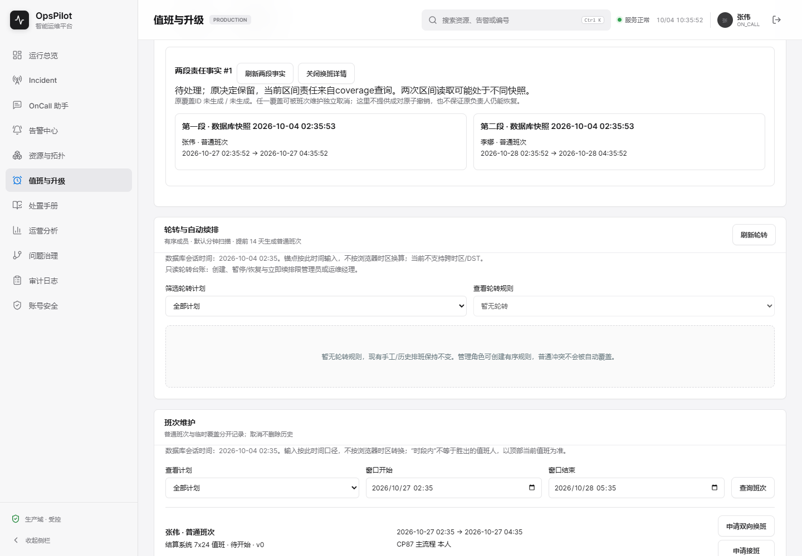
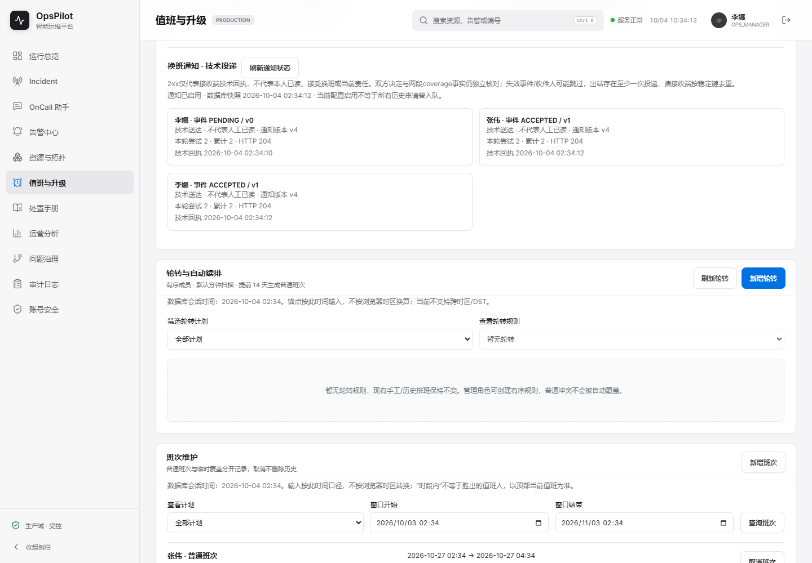
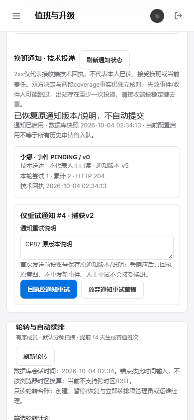
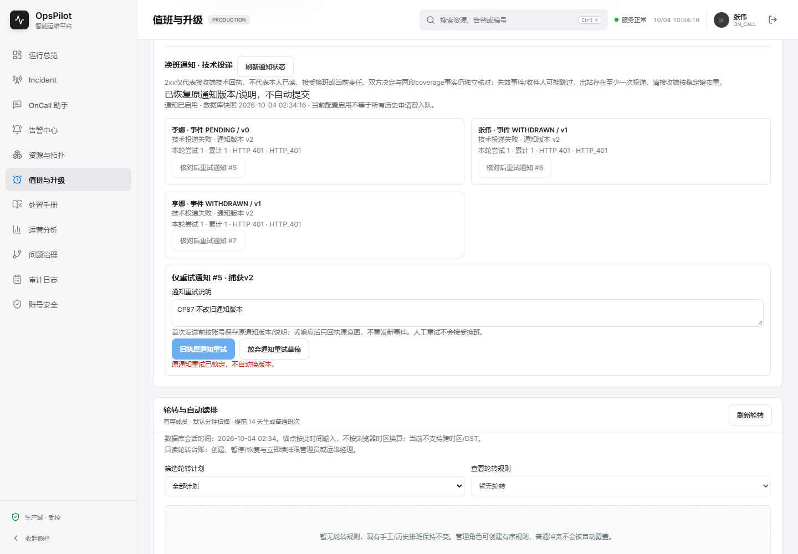
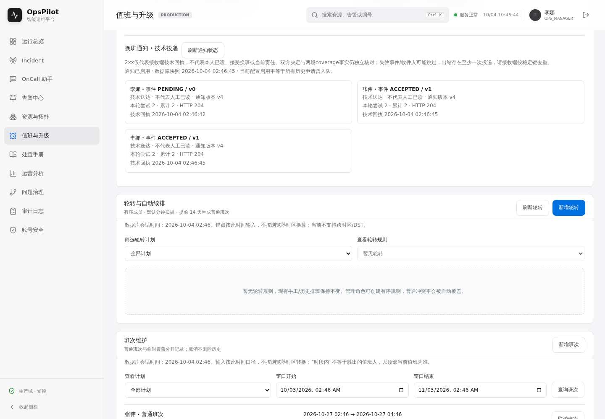
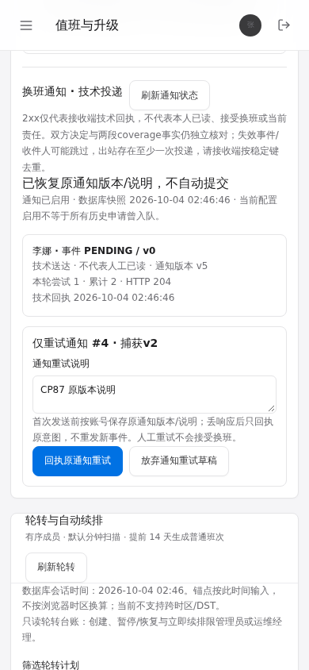
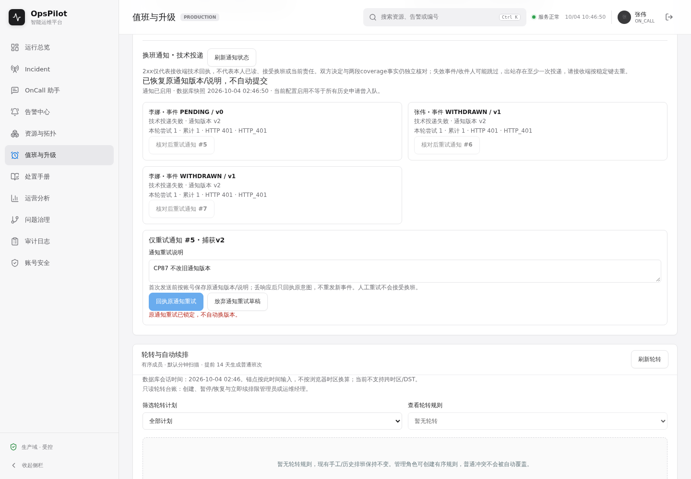

# V1.7 checkpoint 87：双向换班通知与独立投递事实

初次状态：CONTRACT_AND_IMPLEMENTATION_IN_PROGRESS。基线bccd96a（文档CI仍在运行），功能源4a4141c已按86第六节完成自身十八CI与九ZIP核验。本轮未签字，不以实现/构建替代真实通知和页面验收。

## 1. 业务边界与验收合同

参考[Grafana通知开放申请并在接班后通知双方](https://grafana.com/docs/grafana-cloud/observe-and-act/respond-to-incidents/on-call-schedules/shift-swaps-overrides/)。其单向请求代班不等同OpsPilot双向交换；本轮沿用双方实际确认契约，不引入通知自动审批。

默认关闭、专用HTTPS或本机HTTP webhook。启用时申请事务通知指定对方，接受/拒绝/撤回事务通知双方；稳定投递键和不可漂移的两个源窗口/参与者/事件版本快照与原业务同事务，原键/决定重复回执不重新入队。事务外单独有界worker投递，不阻塞现有调度器；逐条条件租约、自动次数上限、退避、过期旧claim回执围栏与失败受控重试。禁止重定向转发专用凭证；不保存响应正文、token、用户输入理由或原申请键到出站载荷。

失效的待处理申请、已变化的事件及失去资格的收件人跳过；人工重试只投递同一冻结历史事件，不修改换班决定/覆盖。页面显示启用情况、收件人、事件版本、技术投递状态/次数/HTTP、清楚声明技术2xx不等于人工已读/接受。已接受历史也不保证当前覆盖，仍独立查询coverage。第三方Slack/短信等真实账户、按时提醒、外部日历、成对原子撤销、DST/部分班次及生产容量不在本轮签字范围，完整路线保留。

## 2. 保留与验证计划

保存旧86生产JAR（37987761212c9e73cedf27ab9b2280d692e16a0aa8d081934729d9692e083d16）、原SwapService/页面和86新旧/失败/远端图。须验证业务/通知联合回滚、唯一入队、真实503→2xx稳定载荷/键、永久失败/次数上限、租约过期/竞态回执、原版本重试和角色权限；MySQL须实际执行逐项JDBC与完整生命周期。实页流程为本人申请→通知技术状态→对方手动确认→双方通知→独立当前coverage；桌面/390px与旧包对照，完整既有页面回归不得替代或删减。Browser plugin not available，使用仓库既有Playwright，不安装新依赖。

## 3. 首轮本地结果与上次文档CI状态

UTC首轮旧换班17+通知17=34项通过；增加单worker/无排队/不阻塞tick场景并修正跨库时间SQL后，第二轮旧17+通知18=35项通过、零跳过/失败/错误。前端旧120+新增通知9=129项通过，类型检查及生产构建通过。新增MySQL门禁的9项合成正反例通过，但不是实际MySQL产品验收。完整双时区、独立接收进程与页面、实际MySQL和本轮源码CI尚待，不签字。

文档基线bccd96a自己的[CI 37169550185](https://github.com/Trigger726/OnCall-Agent/actions/runs/37169550185)最终16成功、tracing失败、container跳过；不是十八全绿。tracing完整日志显示Docker构建下载Maven3.9.9时`Connection reset by peer`，并未进入新通知代码。86功能源码4a4141c自己的十八全绿记录仍按原来源保留，不能替代bccd96a或本轮源码的状态。

## 4. 本地完整功能与页面限定验收

当前状态：LOCAL_SCOPE_PASS_REMOTE_PENDING，不是最终/整体完成。机器证据：[local-proof.json](../assets/v1.7-cp87/local-proof.json)，保存每份XML/完整Maven日志/runner结果/源码/包/图的实际SHA256与测试标识。

| 验证 | 实际结果与边界 |
| --- | --- |
| UTC package / Asia/Shanghai test | 各593发现、451执行、142条件跳过、0失败/错误；各79新鲜XML。对照保存的86原XML，77原套件的数量与全部case标识不变；新H2通知18执行、MySQL通知18本地条件跳过。 |
| 通知事务与HTTP | 新18项覆盖联合回滚、真实503→204稳定键/冻结载荷、永久失败/重定向不转凭证、次数上限、两个dispatcher争抢、旧租约晚200不能覆盖新503、原版本重试、权限/审计回滚、事务内禁止外投、无排队独立worker。通知自己的DirtiesContext池在双时区均有有序关闭。 |
| 生产JAR与独立接收端 | 新包dcc575a3a2495edc2dd5cfeea8e05ce456da29b8ec8dd0752b5af02a44adce8b，真实JVM和独立Node接收进程，专属文件H2和9975/9976端口。真实503→204、申请仍PENDING、手动接受后双方通知及两段coverage交换；不是浏览器伪造通知成功。 |
| 新通知页面 | 九流程：真实申请与瞬态投递、本人决定后双通知、存储失败0POST、真提交丢响应/刷新无自动POST/原版本回执仅一审计、审计只读、读取500清旧事实、失效409跨刷新锁定/明确本地放弃、同文档SPA切换后旧200不改新账号/不擦原意图、损坏草稿不提交。 |
| 原页面 | 原14个整页脚本均exit0（含86七个换班流程）；助手8、原生流6均通过，未削减旧脚本、断言或CI范围。 |
| 前端与门禁 | 前端129/生产构建通过；Node90+生命周期23=113通过；全依赖审计0/106依赖。合成MySQL门禁正反例不算产品MySQL证据。 |
| 旧包负对照 | 379877…旧86包仍能申请/核对两段coverage，但通知GET404、面板不存在、接收端0调用；新旧独立数据库/未来窗口，不是当前P1生产责任。旧包及历史Demo保留。 |

页面环境：Windows、Java21.0.2/release17、Node24.16、Playwright1.63/Chrome154，`http://127.0.0.1:9975/on-call`；Browser plugin not available，按前端验证技能使用仓库现有Playwright，无新依赖。

| 页面检查 | 结果 |
| --- | --- |
| URL/title、非空、无框架错误覆盖 | 通过，实际身份与页面正文断言。 |
| 控件行为 | 九项真实交互与服务器事实核对通过，不凭截图或构建推导。 |
| 控制台 | pageerror0；三条控制台错误仅对应受控丢响应ERR_FAILED、读取500和失效409，响应路径逐项限定。 |
| 桌面/手机 | 1440×1000和390×844；手机等待既有侧栏过渡完成后文档宽度严格390，不放宽无横向溢出断言；新旧截图已目视。 |

首轮实页宽度断言在侧栏过渡时观测593而非390；[原失败图](../assets/v1.7-cp87/first-failure/failure-0.png)和原结果保留。只在runner复用现有`main-frame.left===0`稳定条件，不更改生产布局或放宽390断言。第二轮六流程已走完，但runner将响应的`/api/v1/...`路径与缺前缀的期望比较而失败；修正完整路径，原失败也留在proof。第三轮六流程、第四轮九流程通过；不能抹去首次失败。

完整Maven日志包含既有受控故障注入，不能称所有ERROR文本为0；40个启动池中日志只有8个明确关闭，本轮不声称其余缓存测试上下文均有关闭证据。新增通知自己的池明确有序关闭；Windows owned进程确认已停止，但日志无JVM shutdown hook，不称优雅停机。Linux/MySQL门禁另要求完整有序关闭。本地没有Docker，不以H2或条件跳过冒充MySQL验收。

## 5. 演示效果与未完成范围

旧页面仅有双方责任事实，新页面新增独立技术投递台账；已送达仍待人决定，恢复区同时显示当前技术送达及冻结的原重试版本，手动回执不会重新作决定。409锁定后只能核对并明确清本地草稿，不自动变更版本。

当前待本轮源提交CI：MySQL8.4独占schema十八通知场景逐项真实JDBC/V35和完整池关闭、新Linux独立接收端九页面流程及原全部作业/最终容器。历史bccd96a网络失败保留，不能用本地结果覆盖。通知至少一次投递，远端必须按稳定键去重；资格只在HTTP前最后DB观察，不保证与远端原子一致。缺少通知保留/清理策略、真实Slack/短信账户、生产容量、自动提醒/日历、开放认领、成对原子撤销、跨时区/DST和完整路线，目标继续active。

### 新旧截图

## 6. 自身首次远端结果：整体失败，限定结果独立保留

d119eb7/[Run37171869657](https://github.com/Trigger726/OnCall-Agent/actions/runs/37171869657)已结束：16成功、换班MySQL作业失败、最终container跳过，不能称十八全绿。[首次远端proof](../assets/v1.7-cp87/first-remote-proof.json)记录九个选定ZIP的源HEAD/run、官方摘要、实际下载SHA256/字节数、安全解包与独立重放；范围不是全部CI工件。

实际MySQL8.4.11/专用opspilot_swap_notification_test十八通知case均有各自JDBC身份/V35，十七通过、一失败、零跳过。唯一失败是接受时通知真实CHECK错误3819/HY000/cp87_reject_decision被Spring包装为UncategorizedSQLException，而原测试仅接受H2的DataIntegrityViolationException，故后续联合回滚断言未执行；不能以日志出现约束错误声称该回滚已验。原门禁独立重放拒绝这份失败XML/完整BUILD FAILURE，原失败未覆盖，修正与重新验收由[88报告](V1.7-checkpoint-88.md)另记。

其余选定范围：原MySQL换班17、原生18、一般兼容99/五池及双JVM六场景/Provider10/最终SQL与双节点完整停机均通过原门禁独立重放；H2原生七XML63、双时区各451实际执行/142条件跳过/共158新鲜XML匹配自己的本地套件。十二runner PASS、21完整JAR日志意外ERROR0、19明确有序池关闭；另两次设计中的SIGKILL不称优雅停机。

Linux实页：原14整页脚本（含86七换班）、助手8、原生6及新增通知九流程通过；新九case标识与自己的Windows结果一致。独立Node接收进程实际503→204/稳定键与冻结body、技术送达仍PENDING、人工确认后双方事件、原版本失响应恢复、一审计及409/账号晚200围栏逐项核验。页面URL/title/非空/无overlay/pageerror0/390文档宽度成立；三控制台记录仅受控ERR_FAILED、500和409，响应路径限定。Frontend作业129零失败/生产构建与全依赖审计0/106依赖另验，不从历史129推导。

根据前端验证技能已目视本次实际Linux153Chromium的双方事件、390px冻结恢复和409锁定三图，未新增生产UI或改变业务含义。旧86包/Windows新旧图/本地两次失败/本次MySQL失败都保留。通知保留清理、真实第三方渠道/人工已读、提醒/日历、成对撤销、DST/部分班次/开放认领及整体目标仍未完成。

### 本次Linux实际图

